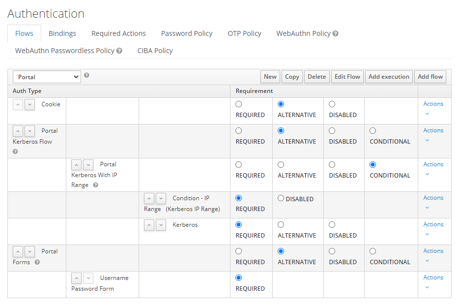
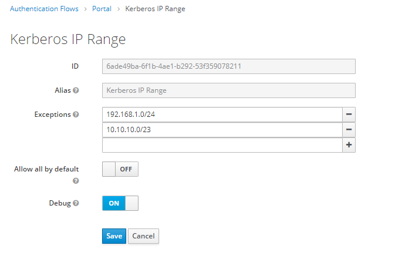

## Keycloak IP range condition module

This module allow using the IP range condition in authentication flows.

## Installation

First, compile the module with:

```
mvn clean install
```

Second, copy kkeyser-auth-iprange.jar from **target** to **deployments** directory of your Keycloak installation.

## How to use

This is example of using this module. In this flow, Kerberos authorization will be used only if client is belong to the defined IP networks.




